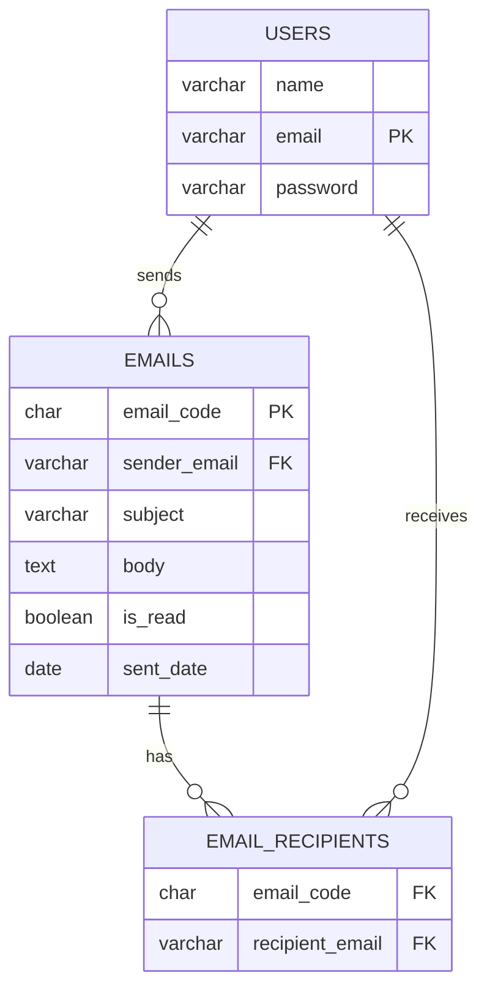

# Milou — Minimal Terminal Email Service 🐶✉️

> A small, terminal-based email service inspired by Tintin's dog *Milou* (Milou = Snowy). Built for learning software design, persistence (Hibernate), and basic UX in a CLI environment.

---

## Table of Contents

1. Overview ✨
2. Features ✅
3. Architecture & Design 🏗️
4. Data Model (ER) 🗂️
5. Project Structure 📁
6. Requirements & Prerequisites ⚙️
7. Database Setup (MySQL) 🛠️
8. Configure & Run ▶️
9. Sample Seed Data 🧪
10. Logging & Hiding Logs 📝
11. Security Notes 🔒
12. Recommended Improvements (Bonus / Extra Credit) 🚀
13. Troubleshooting & Common Errors ❗

---

## 1. Overview ✨

Milou is a compact, text-based email application written in Java (JDK 17), using Hibernate for persistence and MySQL as the database. The app implements core email interactions: sign up, login, send, view (all / unread / sent), read-by-code, reply (to sender + all original recipients), and forward.

This README is intentionally detailed and includes setup, usage examples, DB scripts, and a Mermaid ER diagram.

---

## 2. Features ✅

* Sign up / Login (email may be entered with or without `@milou.com`) 🧾
* Send email to one or more recipients ✉️
* Automatic 6-character code generation for each email (for reading by code) 🔑
* View: All / Unread / Sent lists (sorted newest → oldest) 📃
* Read email by code (access control enforced) 🔒
* Reply: sends to original sender **and all original recipients**, subject auto-prefixed with `[Re]` ↩️
* Forward: forwards email content to specified recipients, subject auto-prefixed with `[Fw]` 🔁
* Basic validation and user-friendly error messages 🚫

---

## 3. Architecture & Design 🏗️

The app follows a simple layered design:

* **View** (`final_project.view`) — CLI screens, prompts, and result formatting.
* **Controller** (`final_project.controller`) — business logic: authentication, send/reply/forward flows.
* **Model / Persistence** (`final_project.model`, `final_project.framework`) — JPA entities (`User`, `Email`) and a small Hibernate helper (`SingletonSessionFactory`).

Flow example (Send): `View -> Controller.sendEmail() -> Persistence (Hibernate) -> DB`

Design considerations:

* Separation of concerns (UI vs logic vs persistence).
* Defensive input validation (missing fields, invalid codes, unauthorized reads).
* Logs are written to a file (recommended) rather than leaking to the terminal by default.

---

## 4. Data Model (ER) 🗂️

The main entities are `User`, `Email`, and `Email_Recipient` (join table).



Notes:

* `Users.email` is the unique identifier for users.
* `Emails.email_code` is the 6-character public code used to read emails.
* Recipients are modeled with a join table to support multiple recipients per email.

---

## 5. Project Structure 📁

```
MilouEmailServiceApp/
├─ pom.xml
├─ src/main/java/final_project/
│  ├─ Main.java
│  ├─ controller/
│  │  ├─ UserController.java
│  │  └─ UserAuthenticator.java
│  ├─ model/
│  │  ├─ User.java
│  │  ├─ Email.java
│  │  └─ CodeGenerator.java
│  ├─ view/
│  │  ├─ LoginPage.java
│  │  ├─ HomePage.java
│  │  └─ ReadEmailPage.java
│  └─ framework/
│     ├─ SingletonSessionFactory.java
│     └─ scripts.sql
└─ src/main/resources/
   ├─ hibernate.cfg.xml
   └─ log4j2.properties
```

---

## 6. Requirements & Prerequisites ⚙️

* Java 17 (JDK)
* Maven
* MySQL (or compatible, e.g., MariaDB)
* Optional: IDE like IntelliJ

---

## 7. Database Setup (MySQL) 🛠️

Follow these steps to create the database and tables.

1. Login to MySQL:

```bash
mysql -u root -p
```

2. Create the database:

```sql
CREATE DATABASE milou_email_service_app CHARACTER SET utf8mb4 COLLATE utf8mb4_unicode_ci;
USE milou_email_service_app;
```

3. Execute SQL script (provided in the repo):

```bash
# From project root
mysql -u root -p milou_email_service_app < src/main/java/final_project/framework/scripts.sql
```

> If you prefer, you can open the `scripts.sql` file and run the DDL/DML manually in your client.

---

## 8. Configure & Run ▶️

### 8.1 Configure Hibernate

* Copy `src/main/resources/hibernate.cfg.xml.template` → `hibernate.cfg.xml`.
* Edit connection properties (URL, username, password):

```xml
<property name="hibernate.connection.url">jdbc:mysql://localhost:3306/milou_email_service_app</property>
<property name="hibernate.connection.username">your_db_user</property>
<property name="hibernate.connection.password">your_db_pass</property>
```

**Important:** Do not commit real credentials. Use environment variables or a local-only config file for sensitive info.

### 8.2 Build & Run (Maven)

From the project root:

```bash
mvn compile
mvn exec:java -Dexec.mainClass="final_project.Main"
```

If `exec:java` is not configured in `pom.xml`, either:

* Run `Main` from your IDE; or
* Add `exec-maven-plugin` to `pom.xml`. Example:

```xml
<build>
  <plugins>
    <plugin>
      <groupId>org.codehaus.mojo</groupId>
      <artifactId>exec-maven-plugin</artifactId>
      <version>3.1.0</version>
      <configuration>
        <mainClass>final_project.Main</mainClass>
      </configuration>
    </plugin>
  </plugins>
</build>
```

### CLI interaction sample

When the program starts, it prompts:

```
[L]ogin, [S]ign up:
```

* Enter `L` or `Login` to sign in, or `S` or `Sign up` to create an account.
* On login you can enter email as `sam` or `sam@milou.com` — the system will normalize it to `@milou.com`.

Once logged-in, you will see unread emails and the command menu:

```
Welcome back, Sam!
Unread Emails:
+ mamad@milou.com - Our new meeting (1bc170)

[S]end, [V]iew, [R]eply, [F]orward:
```

---

## 9. Sample Seed Data 🧪

You can insert sample data to test the app quickly. Example SQL:

```sql
INSERT INTO Users (name, email, password) VALUES
('Sam','sam@milou.com','password123'),
('Nika','nika@milou.com','nikapass12'),
('Mamad','mamad@milou.com','mamadpass'),
('Raees','raees@milou.com','raeespass');

INSERT INTO Emails (email_code, sender_email, subject, body, is_read, sent_date) VALUES
('1bc170','mamad@milou.com','Our new meeting','Meeting tomorrow at 10am', false, '2025-12-01'),
('fnjd1o','raees@milou.com','Book suggestions','I recommend these three books...', false, '2025-12-02'),
('12dsb1','nika@milou.com','New feature','We\'re excited to introduce a new feature — Post Scheduling!', false, '2025-12-03');

INSERT INTO Email_Recipients (email_code, recipient_email) VALUES
('1bc170','sam@milou.com'),
('fnjd1o','sam@milou.com'),
('12dsb1','sam@milou.com'),
('12dsb1','raees@milou.com');
```

After inserting, login as `sam` to see the unread list.

---

## 10. Logging & Hiding Logs 📝

By default the project uses Log4j2 (check `src/main/resources/log4j2.properties`). To avoid showing internal logs to terminal users (requirement):

**Option A (preferred):** Log to a file

```properties
rootLogger.level = info
rootLogger.appenderRefs = file
rootLogger.appenderRef.file.ref = file
appender.file.name = file
appender.file.type = File
appender.file.fileName = logs/milou.log
appender.file.layout.type = PatternLayout
appender.file.layout.pattern = [%d{ISO8601}] [%p] %c - %m%n
```

**Option B:** Raise global log level to `ERROR` to reduce output.

Also ensure logs never contain plaintext passwords or PII. Use redaction if necessary.

---

## 11. Security Notes 🔒

* Don’t commit `hibernate.cfg.xml` with real credentials. Use environment variables or a secrets manager.
* Validate inputs to avoid extremely long subjects/bodies — consider DB column types (`TEXT`) or truncation.

---

## 12. Recommended Improvements (Extra Credit) 🚀

Ideas that can earn extra credit or make the app production-ready:

* Implement password hashing (bcrypt/Argon2) ✅
* Add unit/integration tests with an in-memory DB (H2) ✅
* Create a GUI (JavaFX) or web frontend (Spring Boot + React) 🎨
* Add attachments, search, delete, labels, drafts ✉️
* Implement paging for long email lists and robust input sanitization 🧹
* CI pipeline (GitHub Actions) to run tests and builds 🔁

---

## 13. Troubleshooting & Common Errors ❗

* **"Email already exists"** — during signup, pick a different email.
* **"Password too short"** — signup requires ≥ 8 characters.
* **"You cannot read this email."** — user tried to read an email for which they are neither sender nor recipient.
* **Invalid Code** — the 6-char code entered did not match any email.
* **DB connection errors** — check `hibernate.cfg.xml` and MySQL status.

---
